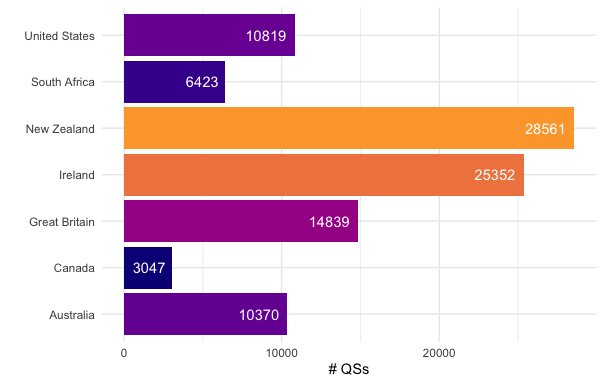

^[]
[]()

```{r setup, include=FALSE}
knitr::opts_chunk$set(echo = TRUE, eval = FALSE)

# packages 
library(reticulate)
```

We present a deep learning approach to classifying labeled texts and phrases in party manifestos, using the coding scheme and documents from Manifesto Project [@volkens2019manifesto]. We use English-language texts from the Manifesto Project Corpus, which divides party manifestos into statements---or *quasi-sentences*---that do not span more than one grammatical sentence. Based on the state-of-the-art deep learning methods for text classification, we propose using Bidirectional Encoder Representations from Transformers (BERT) combined with neural networks to automate the task of labeling political texts. We compare our models that combine BERT and neural networks against previous experiments with similar architectures to establish that our proposed method outperforms other approaches commonly used in natural language processing research when it comes to choosing the correct policy domain and policy preference. We identify differences in performance across policy domains, paving the way for future work on improving deep learning models for classifying political texts. To the best of our knowledge, we offer the most comprehensive application of deep language representation models incorporated with neural networks for document classification of political manifesto statements. 

This post is structured as follows. In the related work section, we provide a brief overview of the current state-of-the-art in classification of political texts, focusing mainly on detecting policy domains and preference. In the Data section, we into detail about the Manifesto Project Corpus. The methdology section then introduces our classification approach and provides important details of our models and evaluation approach. We then present our results and address some limitations of our system. Finally, we conclude our findings and set up a roadmap for future improvements.

## Related Work 

## Data 

The Manifesto Project Corpus [@volkens2019manifesto] provides information on policy preferences of political parties from seven different countries based on a coding scheme of seven policy domains, under which 57 policy preference codes are manually coded. The Manifesto Project offers data that divides party manifestos into quasi-sentences, or individual statements which do not span more than one grammatical sentence. Quasi-sentences are then individually assigned to categories pertaining to policy domain and preference. The 57 policy preference codes, one of which is "not categorized", refer to the position---positive or negative---of a party regarding a particular policy area. The 57 policy preference codes fall into a macro-level coding scheme comprising of 8 policy domain categories. In political science research, the Manifesto Project Corpus is particularly useful for studying party competition, the responsiveness of political parties to constituent preferences, and estimating the ideological position of political elites. While the official classification of manifestos in this dataset has primarily relied on human coders, the investigation of automatically detecting policy positions of the text data is valuable for scaling up the classification of large volumes of political texts available for analysis.

Our final subset of all English-language manifestos comprises of 99,681 quasi-sentences. To ensure that the ratio between policy domains remains consistent across policy domains in running our models, we applied a 70/15/15 split between training, validation, and test sets separately for the 8 major categories and the 58 minor categories.

```{r fig1, eval = TRUE, echo = FALSE, out.width = '100%', fig.cap = "Quasi-sentences (QSs) from English language manifestos by policy domain"}
knitr::include_graphics("figures/desc-major.png")
```

```{r fig2, eval = TRUE, echo = FALSE, out.width = '100%', fig.cap = "Quasi-sentences (QSs) from English language manifestos by country"}

```

## Experimental Setup 

### Bidirectional Encoder Representations from Transformers (BERT)

Bidirectional Encoder Representations from Transformers (BERT) have proven successful in prior attempts to classify phrases and short texts [@devlin2018bert].
BERT's key innovation lies in its ability to apply bidirectional training of transformers to language modelling. This state-of-the-art deep language representation model uses a "masked language model", enabling it to overcome restrictions caused by the unidirectional constraint.

Our experiments use the standard pre-trained BERT transformers as the embedding layer in our model. Since BERT is trained on sequences with a maximum lengths of 512 tokens, all quasi-sentences with more than 510 words were trimmed to fit this requirement. Pre-trained embeddings were frozen and not trained for the base models. We test two variants of BERT---one incorporating a bidirectional GRU model, and another incorporating CNNs. 

The training times for our neural networks and deep language representation models are: 

```{r fig3, eval = TRUE, echo = FALSE, out.width = '100%', fig.cap = "Training time for neural networks and deep language representation models for classifying political texts by major and minor policy domain"}

```

Model parameters for BERT-CNN:

```{python bertcnn model parameters}
OUTPUT_DIM = len(LABEL.vocab)
DROPOUT = 0.5
N_FILTERS = 100
FILTER_SIZES = [2,3]

model = BERTCNN(bert,
                OUTPUT_DIM,
                DROPOUT,
                N_FILTERS,
                FILTER_SIZES)
```

```{r fig4, eval = TRUE, echo = FALSE, out.width = '100%', fig.cap = "Model architecture"}
knitr::include_graphics("figures/BERTfig3.png")
```

```{r fig5, eval = TRUE, echo = FALSE, out.width = '100%', fig.cap = "Average precision, recall and Macro-F1 score by policy domain across all models"}

```


